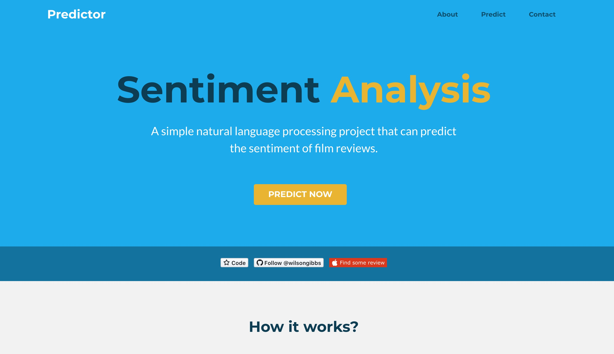
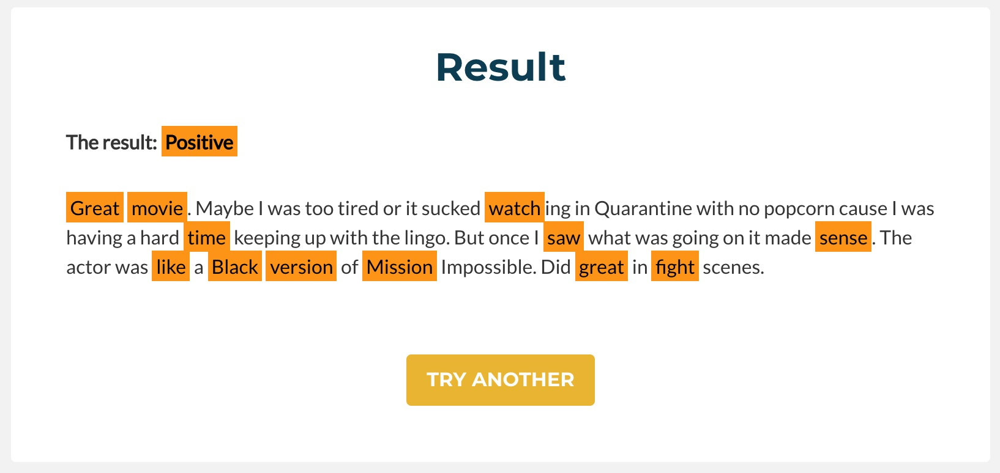
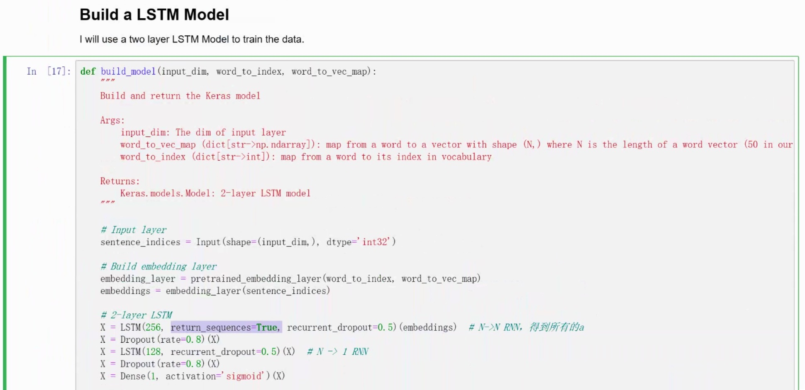

# Film Review Sentiment Analysis

This is a simple natural language processing project that can predict the sentiment of film reviews. The model is trained by `Tensorflow` and I used `Flask` deploy this predictor on my server. You can find all the code in this repository.

# How to use

 Simply build the `Flask` environment first, then switch to `nlp_flask` floder and type:

```
python runserver.py
```

Then use your brower to play with it. You can test whatever film review you like! If you want it to be accessible anywhere, you can deploy it on your own server, though it will take up a lot of memory : )

### Screenshots






# How it works

This predictor is built by Python using the LSTM neural network. You can you Jupyter Notebook to creat the mode and evaluate the accuracy. For this project, the best accuracy I got is 87.36%, if you want to reach higher accuracy, you may need more computing resource.

## Structure of the model



# Download Resouces

You can download models, embeding, and training data here:

* Link: [Download](https://1drv.ms/u/s!AqMUlRKFxCHNhOhOfA1MTQdOXYqQOw?e=FRAdYa)

* Password: nlpresource

# Thanks

* Using bootstrap theme designed by [Xiaoying Riley](https://themes.3rdwavemedia.com/)